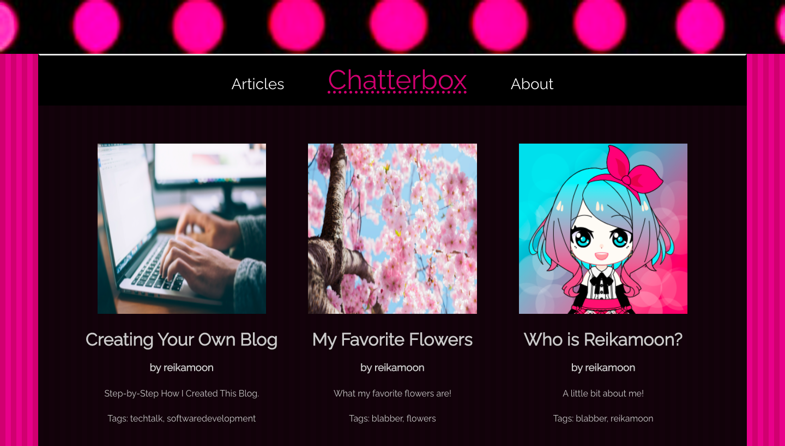

# Chatterbox :lips:
by reikamoon :ribbon:

## Table of Contents :paperclip:
[Preview](#img)<br>
[Project Description](#desc)<br>
[Technologies Used](#tech)<br>
[Warnings Before Installation](#warning)<br>
[Installation](#installation)<br>
[Resources](#resources)<br>

<a name="img"></a>
## Previews :open_file_folder:

<i>Preview Image of My Blog App so Far!</i>

<a name="desc"></a>
## Project Description :memo:
Full Stack Blog App created with REACT, Node.js, and uses MongoDB for the database.
Users can read articles that I wrote for my blog.

<a name="tech"></a>
## Technologies Used :hammer:
<b>React, Node.js, Express, React Router Dom, MongoDB </b>

<a name="warning"></a>
## Warning :bangbang:
Before installing, make sure you have Node.js/npm installed.
>[Node Installation](https://nodejs.org/en/download/)<br>
>[Npm Docs](https://docs.npmjs.com/downloading-and-installing-node-js-and-npm)


<a name="installation"></a>
## Installation :wrench:
:one: Clone the repository<br>
```git clone https://github.com/reikamoon/blogapp.git```<br>
:two: Install dependencies for the <b>Front End</b> side.<br>
```cd frontend```<br>
```npm install```<br>
:three: Install the depedencies for the <b>Back End</b> side.<br>
```cd backend```<br>
```npm install```

<a name="resources"></a>
## Resources :book:
Image(s) found on [Unsplash](unsplash.com)<br>
Raleway Font from [Google Fonts](https://fonts.google.com/specimen/Raleway?query=raleway)<br>
Icons from [Font Awesome v.5](https://fontawesome.com/v5.15/icons?d=gallery&p=2)<br>


